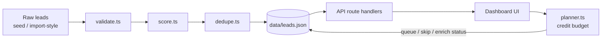

# LeadRank

Caprae Capital handbook task — focused improvement on top of [SaaSquatch Leads](https://www.saasquatchleads.com/), not a full rebuild.

SaaSquatch already scrapes and enriches leads. The expensive part is enrichment credits. After looking at the product, the gap I cared about was: **which leads are actually worth enriching, and which ones are junk / duplicates?**

LeadRank sits in that gap.

## What I built (two improvements)

1. **Lead quality score + enrichment priority queue**  
   Each lead gets a 0–100 score from title seniority, company fit (ICP industry + size), revenue signal, and profile completeness, minus validation penalties. High scores (≥70) go to the front of the enrich queue.

2. **Validation + dedupe**  
   Flags bad/missing/disposable emails and domain mismatches. Dedupes on email and company+contact so you don't pay twice for the same person scraped from two sources.

Demo heuristic: duplicates + low-score leads ≈ credits you'd skip.

## Scoring formula (`src/lib/score.ts`)

```
score = clamp(0, 100, round(
  titleSeniority + companyFit + dataCompleteness + revenueSignal − validationPenalty
))
```

| Component | Max | How it is earned |
| --- | ---: | --- |
| **titleSeniority** | 30 | Senior titles (CEO/CTO/VP/Director/…) → 30; mid (manager/lead/…) → 18; else → 8 |
| **companyFit** | 30 | Target ICP industry (software/SaaS/fintech/…) → +18, else +6; then employee band: 20–500 → +12, 501–2000 → +8, &lt;20 → +4, else +2 (capped at 30) |
| **dataCompleteness** | 20 | email +6, phone +4, LinkedIn +4, domain +3, revenue present +3 |
| **revenueSignal** | 15 | $5M–$50M → 15; $1M–$5M → 11; &gt;$50M → 8; known but low → 5; missing → 4 |
| **validationPenalty** | −25 | invalid email −12; disposable −15; domain mismatch −8; missing email −4; incomplete profile −3 (capped at 25 total) |

Theoretical max before penalties is **95** (30+30+20+15); result is clamped to **0–100**. Priority bands: ≥70 high, ≥45 medium, else low. Breakdown is stored on each lead so the score is explainable in the UI.

## Why this (business value)

- Enrichment credits represent a potentially costly resource, so prioritizing which leads should consume those credits can create direct operational value. Wasting them on low-fit leads, duplicate rows, or invalid/disposable emails creates avoidable enrichment cost.
- Salespeople don't need more scrape volume — they need a ranked shortlist.
- Fits Caprae's "1–2 high-impact improvements in ~5 hours" constraint.

## Quick start

```bash
npm install
npm run dev
```

Open [http://localhost:3000](http://localhost:3000).

First boot writes seed data to `data/leads.json` (already includes intentional duplicates so dedupe is obvious).

## Stack

| Layer | Choice |
| --- | --- |
| Frontend | Next.js 14 (App Router) + React + CSS Modules |
| Backend | Next.js Route Handlers |
| Storage | JSON file store under `/data` (zero setup for reviewers) |
| Hosting target | Vercel (or any Node host) |

No external lead APIs in the demo — scoring/validation run locally on seeded + imported-style sample data so the review doesn't depend on paid keys.

## Architecture / data flow

LeadRank sits **between scrape and enrich**: SaaSquatch (or any scraper) produces raw leads → LeadRank validates, scores, and dedupes → only high-priority unique leads consume enrichment credits.



**Pipeline (per lead):**

1. **Ingest** — first boot seeds `data/leads.json` (intentional duplicates included); later updates go through the store.
2. **Validate** — missing/invalid/disposable email + email-vs-company domain mismatch + incomplete profile flags.
3. **Score** — 0–100 from `titleSeniority` + `companyFit` + `dataCompleteness` + `revenueSignal` − `validationPenalty` (see Scoring formula).
4. **Dedupe** — same email or company+contact → mark duplicates so credits aren't spent twice.
5. **Rank / plan** — UI lists by score; `planner.ts` picks the best N unique leads for a given credit budget.
6. **Act** — status updates (`queued` / `enriched` / `skipped`) write back to the JSON store; CSV export of the filtered view.

**Request path:** `Dashboard` → `GET/PATCH/POST /api/leads/*` → `store.ts` (read/write JSON) → `validate` / `score` / `dedupe` / `planner` as needed → JSON response → UI.

## Technical decisions

### Frontend / backend
Next.js 14 App Router for the UI; Route Handlers for the API. Keeps the demo backend inside the same application and avoids unnecessary infrastructure for a ~5-hour prototype.

### Database / storage
JSON file store under `/data`. The challenge is evaluated as a focused prototype — JSON provides persistence without requiring reviewers to configure PostgreSQL/MySQL.

### APIs / data sources
No external lead or enrichment APIs in the demo. Scoring, validation, and dedupe run locally on seeded (import-style) sample data so review does not depend on paid keys or third-party uptime.

### Why deterministic scoring?
The score is explainable and reproducible. A reviewer or salesperson can see why a lead received a particular priority (breakdown + validation flags) without relying on an external AI API.

### Performance / caching
No response caching layer is implemented. API routes use `force-dynamic` so each request reads fresh state from `data/leads.json`. That is intentional for a small mutable demo store.

Performance still stays predictable: scoring, validation, dedupe, filtering, and the credit planner all run in-process against the local dataset. Normal dashboard interaction makes no external enrichment calls, so there is no third-party API latency.

### Hosting / deployment / cloud
Target deployment: Vercel (or any Node host that can run Next.js). Cloud provider for the deployed app: Vercel.

## Project layout

```
src/app/api/leads/     REST endpoints
src/components/        Dashboard UI
src/lib/score.ts       Scoring
src/lib/validate.ts    Email/domain checks
src/lib/dedupe.ts      Duplicate detection
src/lib/planner.ts      Credit-budget enrich recommendations
src/lib/store.ts       Persistence + filters + CSV export
src/lib/seed.ts        Demo dataset
```

## API (short)

- `GET /api/leads` — list + stats (`q`, `minScore`, `industry`, `status`, `hideDuplicates`)
- `PATCH /api/leads/:id` — update status (`queued` / `enriched` / `skipped`)
- `POST /api/leads/dedupe` — re-run dedupe
- `POST /api/leads/reset` — restore seed data
- `GET /api/leads/export` — CSV of current filtered view
- `GET /api/leads/plan?budget=5` — smart enrich recommendations
- `POST /api/leads/plan` — `{ budget, apply: true }` queues recommended leads

## What I'd do next (out of scope)

- Wire real enrichment provider webhooks
- Fuzzy name matching (Levenshtein) for near-duplicates
- Team ICP presets per customer
- Postgres instead of JSON if this left the demo stage

## Video walkthrough notes

Cover: problem (credit waste) → score model → dedupe demo → smart enrich planner (budget) → why not rebuild whole product.
